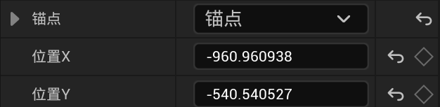
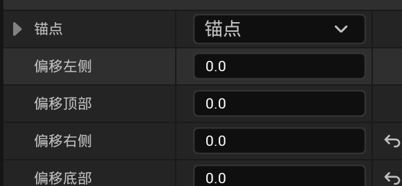
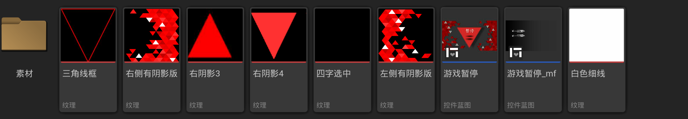
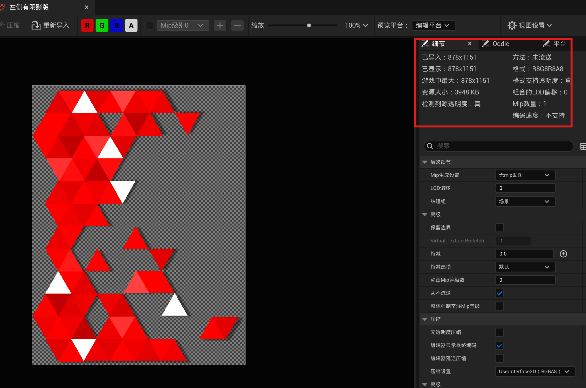
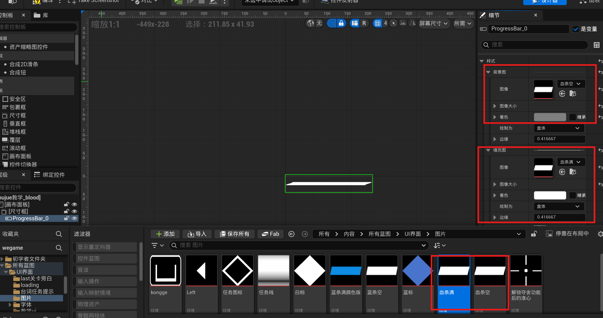
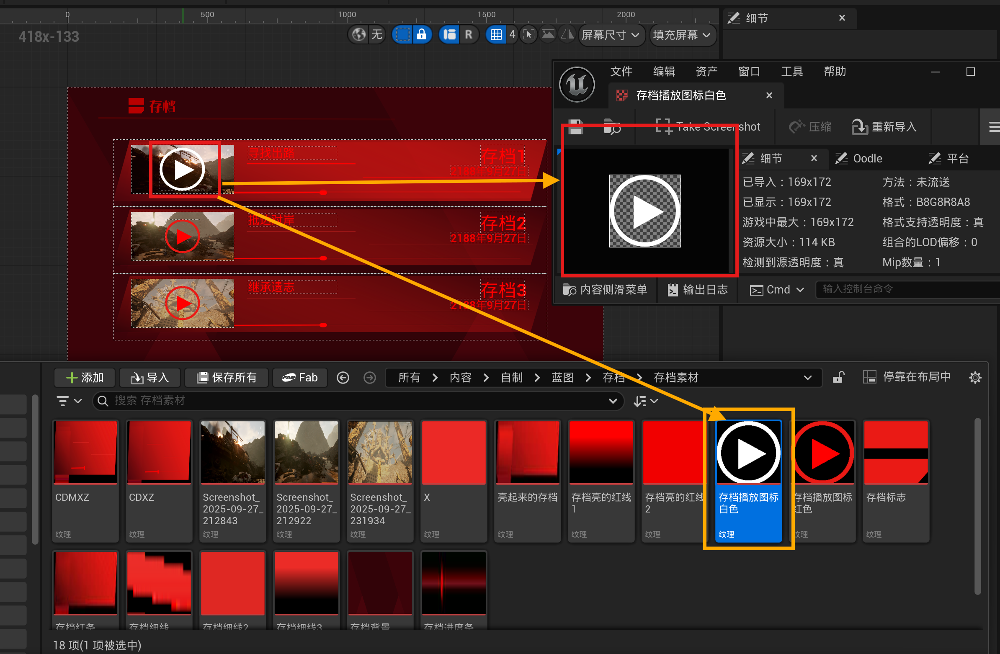

**UE5 UI项目开发规范**

------ 美术 ------

UE5 项目中所有 UI 贴图、图标、动效素材、切图资源的制作与输出

## 

  ----------------------------- ----------------------------------------------
  **原则**                      **说明**

  资源标准                      统一尺寸、命名、格式，降低沟通成本

  素材轻量                      使用九宫格、图集、通道打包减少资源数量

  动效素材                      提供基础素材 + 参考，动画交给 Material 实现

  画风简约                      界面简洁干净，功能清晰即可。避免复杂花哨动效

  视觉保真                      确保导入 UE 后视觉效果与设计稿一致
  ----------------------------- ----------------------------------------------

# 1. UI图片尺寸规范

## 1.1 基础原则

**所有 UI Texture（贴图）必须采用 Power of Two（2的幂次方尺寸）。**

## 1.2 推荐尺寸

  ------------------------------ ----------------------------------------
  **类型**                       **推荐尺寸**

  小图标                         64×64 / 128×128

  技能图标                       128×128 / 256×256

  UI按钮                         256×256 / 512×512

  背景资源                       1024×1024 / 2048×2048

  大型界面背景                   2048×2048
  ------------------------------ ----------------------------------------

## 1.3 禁止尺寸

**以下类型尺寸严格禁止：**

> ✖ 100×100 ✖ 300×500 ✖ 750×430

原因：

- 无法有效生成 Mipmap（多级纹理）

- GPU 缓存利用率降低

- 容易产生边缘锯齿

- 增加显存碎片

## 1.4图标位置

- 最好可以有每个图标位于画布的位置坐标。以便于程序精准还原美术UI界面设计方案

{width="3.1080708661417322in" height="0.7596292650918636in"} {width="2.7760662729658794in" height="1.2853051181102362in"}

Ue用户界面素材位置匹配形式

## 1.5Alpha 通道要求

- 所有 UI 贴图必须包含正确的 Alpha（透明通道）

- 确保边缘过渡自然，无硬边锯齿

- **[导出格式：PNG-24（支持 Alpha 通道），不使用 JPG]{.mark}**

**\**

# 2. UI资源命名规范

## 2.1 命名格式（具体参考文件：UI命名规范）

**统一格式：**

> 类型_模块_名称_用途
>
> 例如：
>
> T_UI_MainMenu_Button_Start_Normal

# 3. UI动效素材交付规范（尽量少动效，难度大耗时长）

**[无需提供完整动画文件]{.mark}。需要提供以下四类素材：**

## 3.1 ① Base Texture（基础贴图）

示例：T_UI_HP_Base

包含：

- 外框结构

- 基础颜色

- 静态结构元素

注意：基础贴图不包含动态效果元素，仅为静态层。

## 3.2 ② Mask Texture（遮罩贴图）

黑白图，用途：

- 控制流光区域

- 控制渐变范围

- 控制特效显示区域

规则：

> 白色 = 显示 黑色 = 隐藏

注意：遮罩贴图不需要精美的视觉效果，仅需确保遮罩范围准确。建议使用硬边缘绘制。

## 3.3 ③ Noise Texture（噪声贴图）

用于：

- 水流效果

- 能量波动

- 科技扫描线

- 火焰/热浪扭曲

推荐尺寸：256×256 或 512×512，灰度图即可。

## 

## 3.4 ④ AE Preview（AE参考动画）

提供以下参考信息：

- 动画速度

- 颜色变化范围

- 缓动曲线类型

- 循环时间

- 效果强度参考

**[注意：AE 仅作为 Visual Reference（视觉参考），不是最终运行资源。动画将由程序在 UE5 Material 中实现。]{.mark}**

# 4. UI美术开发流程

## 4.1美术与程序协作

- 美术提供素材 + 视觉参考，程序负责实现

- 复杂动效使用 Material 而非视频/序列帧

- 所有素材必须符合本规范后才能提交

- 双方使用统一的命名规范，避免沟通混乱

- 所有组件素材单独拆分导出

Eg.ue内素材形式：

{width="6.268055555555556in" height="1.0958333333333334in"}

{width="6.268055555555556in" height="4.15625in"}

{width="6.268055555555556in" height="3.310416666666667in"}

{width="6.268055555555556in" height="4.1in"}
