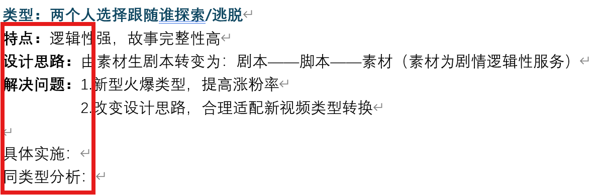

## Ai优化提效撰写优化方案

#### 初步构思：

###### 1.分类型分区块建立ai记忆集（方便ai读取上下文，锻炼ai大模型）

**2.撰写优化方案模版（告诉ai每次分析时告诉我哪些点，从什么方面开始分析**）

Eg.

{width="5.60373687664042in" height="1.836428258967629in"}

###### 3.ai会议录音总结，并要求以模版方式输出

##### **设想：4.ai直接总结成库**

**目前是ai和我一起总结方案后，由我总结输出文档------后续是否可能ai直接读取记录输出并留存一份合格优化方案------我在ai里直接建立优化信息总结库，可随时调取------ai自动生成库并根据会议/上下文记录自动总结放入库**
