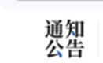
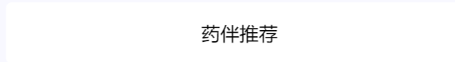
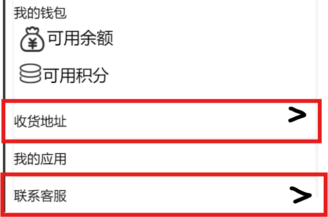
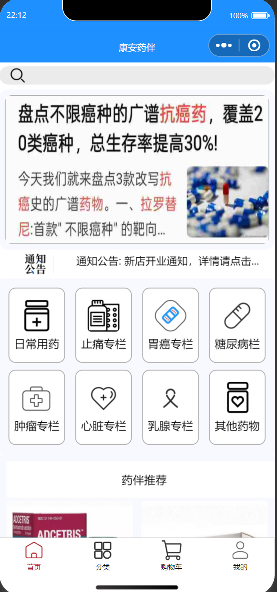
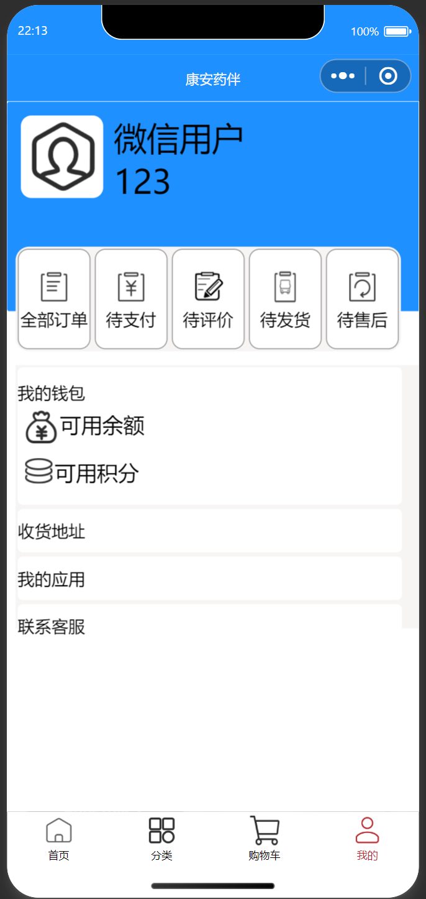

整体布局UI设计需要

四个主要页面：首页/分类/购物车/我的

单独药品界面设计

{width="1.6244860017497813in" height="3.5366557305336834in"}

公告图标设计

{width="1.3647736220472442in" height="0.8334492563429571in"}

首页，推荐图标

{width="5.768055555555556in" height="0.7944444444444444in"}

药品点击进去之后的界面设计

（专栏直接跳转到分类里面不用做设计）

这几个，包括我的钱包，直接做成图案加上后面那个小箭头

图案尺寸**width:700rpx; height:80rpx;**

{width="1.6609590988626421in" height="1.0990923009623796in"}

## 目前界面

{width="3.5050240594925635in" height="7.472602799650044in"}

{width="4.355300743657043in" height="9.17465769903762in"}
